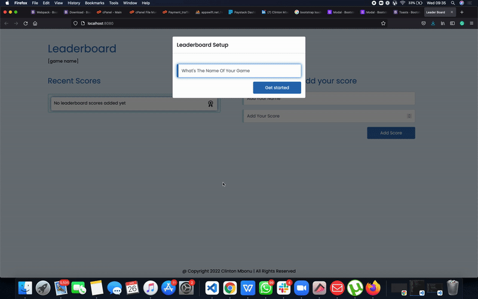

# LeaderBoard

> The leaderboard website displays scores submitted by different players. It also allows you to submit your score.

# Mini Presentation


Additional description about the project and its features.

## Built With

- Major languages (HTML, CSS, JavaScript)
- Frameworks

    ``` bash
     - Bootstrap css framework
    ```
- Technologies used 
  
  ``` bash
  - Webpack(Code Bundlng)
  - Git(version control)
  - ESLint(JavaScript linting)
  - WebHint(linting tool)
  - Stylelint(style linting)
  - Jest(project testing)
  ```

## Live Demo

[Live Demo Link](https://clintonjosephs.github.io/LeaderBoard/)


## Getting Started

To get a local copy up and running follow these simple example steps.

### Prerequisites
 - A text editor(preferably Visual Studio Code)
### Install
  -  [Git](https://git-scm.com/downloads)
  -  [Node](https://nodejs.org/en/download/)
### Usage
#### Clone this repository

```bash
$ https://github.com/clintonjosephs/LeaderBoard.git
$ cd LEADERBOARD
```
#### Run project

```bash
$ npm install
$ npm test
$ npm build
$ npm run start # this will make webpack watching for your changes in code
```

#### Open page in browser
```bash
$ open dist/index.html
```

## Interaction with the Leaderboard API
- Each new game is created with the POST method using 
  ```bash
      { 
          "name": "My cool new game" 
      }
    ```
 This request returns a result that holds the unique ID for that game:

  ```bash
    {
      "result": "Game with ID: Zl4d7IVkemOTTVg2fUdz added."
    }
  ```
>  This gameID is saved in the localStorage automatically
  

  The two allowed actions are posting and getting of the scores
- The POST request creates a new Leaderboard score for the given game sending user and score as parameters like this:
  #### Endpoint
  ```bash
  https://us-central1-js-capstone-backend.cloudfunctions.net/api/games/:id/scores/
  ```
  
  body parameters
  ```bash
  { 
	  "user": "John Doe",
	  "score": 42
  }
  ```
  and it returns 

  ```bash
  {
	  "result": "Leaderboard score created correctly."
  }
  ```
- The GET request returns data in JSON format like this:
    #### Endpoint
  ```bash
  https://us-central1-js-capstone-backend.cloudfunctions.net/api/games/:id/scores/
  ```
  It returns
  ```bash
  {
    "result": [
        {
            "user": "John Doe",
            "score": 42
        },
        {
            "user": "Peter Parker",
            "score": 35
        },
        {
            "user": "Wonder Woman",
            "score": 50
        }
    ]
  }
  ```

  <br>

## Authors

👤 **Clinton Mbonu**

- Location: Nigeria
- GitHub: [@clintonjosephs](https://github.com/clintonjosephs)
- Twitter: [@clintonmbonu_](https://twitter.com/clintonmbonu_)
- LinkedIn: [LinkedIn](https://linkedin.com/in/clinton-mbonu)

## 🤝 Contributing

Contributions, issues, and feature requests are welcome!

Feel free to check the [issues page](https://github.com/clintonjosephs/LeaderBoard/issues).

## Show your support

Give a ⭐️ if you like this project!

## 📝 License

This project is [MIT](https://opensource.org/licenses/MIT) licensed.